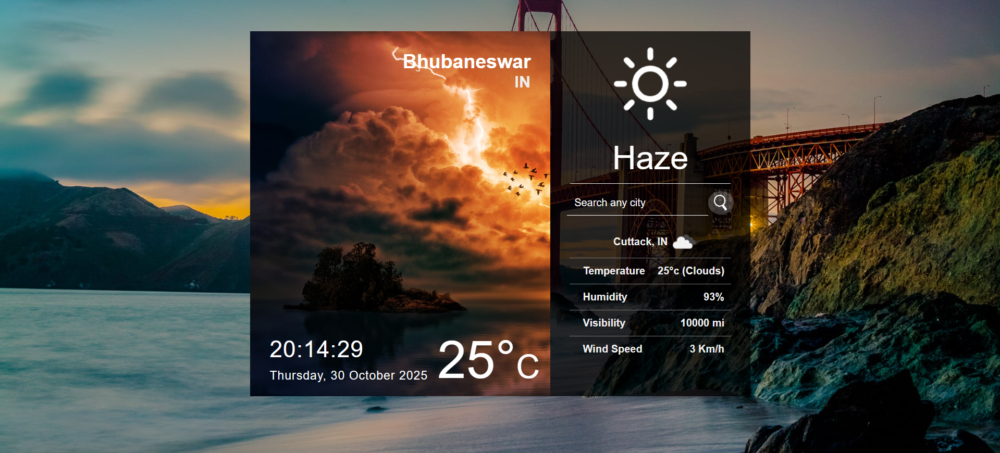

# 🌦️ React Weather App

<p align="center">
  
</p>

<p align="center">
  A simple and elegant Weather App built with React.js that allows users to view weather updates based on their current location or by searching for any city.
</p>

---

## 🌐 Live Demo

<p align="center">
  👉 <a href="https://master.d2gxbs6vwhkz68.amplifyapp.com/" target="_blank">View Live Demo</a>
</p>

---

## 📘 Installation Guide

For a detailed step-by-step tutorial, check out the complete guide here:  
🔗 [How to Create Weather App using ReactJS (with Current Location & Search City)](https://www.htmlhints.com/article/how-to-create-weather-app-using-reactjs-with-current-location-search-city/93)

---

## ⚙️ Setup Instructions

Clone the repository and install dependencies:

```bash
npm i && npm start
